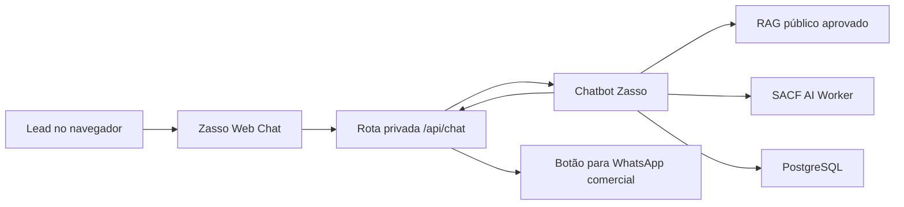

# Arquitetura

## Decisão principal

O repositório web contém somente a experiência do usuário e uma camada segura de
integração. O chatbot atual continua como única implementação das regras de
conversa, RAG, idiomas, qualificação e persistência.

## Responsabilidades

### Navegador

- renderizar as mensagens e o indicador de digitação;
- manter apenas estado visual temporário;
- enviar texto, idioma do navegador e identificador da mensagem;
- nunca receber tokens, conexão de banco ou prompt interno.

### Aplicação web

- emitir cookie de sessão `HttpOnly`, `SameSite=Lax` e com validade de 15 dias;
- validar tamanho e formato de cada entrada;
- autenticar no backend pelo servidor;
- converter a URL `wa.me` em handoff estruturado para a interface;
- ocultar detalhes de falhas internas.

### Chatbot existente

- detectar idioma e intenção;
- recuperar somente FAQs públicas;
- proteger contra prompt injection;
- validar as respostas da qualificação;
- persistir estado, mensagens, lead e handoff;
- construir protocolo, resumo e URL comercial.

## Mudança necessária no chatbot

Adicionar `web` à allowlist de canais aceita por `/v1/messages`. Nenhuma regra de
conversa deve ser copiada para este repositório.
